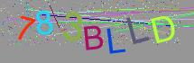

# PHP SecureImage-Captcha for Laravel Sanctum

This project is for those who have a Laravel-Sanctum-based API in place without the possibility of using a stateful-session-based temporary storage, who want to simply create captcha images e.g. for their login process.

The base idea is the serve the user with an image and a encrypted text. Once displaying the image on your site, the user has to submit an input and provide you with the cipher-text. Your server-side implementation can then receive both those inputs and validate the captcha-input using the same class and secret-key (which was used while creating the captcha) to validate if the user input is indead the displayed captcha.

The following attributes can be set via a simple Builder-Interface:
- secret
- cipher (default is aes-128-cbc)
- captcha length
- background color
- TTF-Font
- Number of Lines
- Number of Dots

# Example
```
$captcha = (new SecureImage(env('CAPTCHA_SECRET')))
            ->setFont(__DIR__
            . DIRECTORY_SEPARATOR . '..'
            . DIRECTORY_SEPARATOR . '..'
            . DIRECTORY_SEPARATOR . '..'
            . DIRECTORY_SEPARATOR . 'resources'
            . DIRECTORY_SEPARATOR . 'fonts'
            . DIRECTORY_SEPARATOR . 'arial.ttf')
        ->setNumberOfLines(20) // Random Lines for obfuscation
        ->setNumberOfDots(800) // Random Dots for obfuscation
        ->setBackground(150, 150, 150, 0.4) // RGBA
        ->setLength(7) // Captcha-Length
        ->setWidth(200) // Image Width
        ->setHeight(100); // Image Height

        return $captcha->generateCaptcha();
```



```
$captcha = new SecureImage(env('CAPTCHA_SECRET'));
return $captcha->is_valid($user_input, $cipher_text_generated_with_captcha);
```


